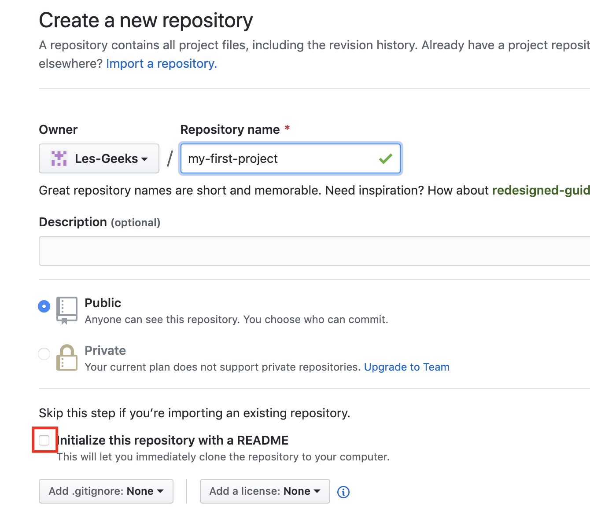

 Formation Gekko !


|   Interne  |   Update   |     Authors     |
|:------------:|:----------:|:---------------:|
| Presentation | 09/12/2019 | Laurent Marques |

---

## Mac OS Préparation de l’environnement de DEV Python

🖥 [Version slide cliquez ici !](https://hackmd.io/@metalfrags/HJJVvw36r) 

---

### Un peu de documentation 😁

* https://www.python.org/dev/peps/pep-3131/

* [Unicode.org](http://www.unicode.org/reports/tr31/)


### Installer Python, pip3, jupiter 

* Telecharger Python 3 dernière version

    * RDV à cette adresse: <https://www.python.org/download/releases/3.0/>

---

### pip3

##### Installer pip3 et ou, le mettre à jour

```Bash
pip3 install pip
pip3 install --upgrade pip
```

**Installer ipython**

```Bash
pip3 install ipython
```
___

**Installer Jupiter**

```Bash
pip install jupyter
```

**Naming convention pour le langage Python**

[https://legacy.python.org/dev/peps/pep-0008/#descriptive-naming-styles](https://legacy.python.org/dev/peps/pep-0008/#descriptive-naming-styles)

### Mettre en place le versionning (Git)

#### Installer le client Git

- RDV à cette adresse: [Git-scm](https://git-scm.com/)

#### Configurer le compte (Github)

```bash=
git config --global user.name "FIRST_NAME LAST_NAME"
git config --global user.email "MY_NAME@example.com"
```
---

#### Changer le terminal par défaut (oh-my-zsh)

- Utilisez l'editeur Emacs
    - <http://www.linux-france.org/article/appli/emacs/tut/emacs-tut-3.html#ss3.1>

---

2. #### Créer son premier repo sur Github

    
Se placer sur le repertoire courant, celui devra avoir le nom du projet Github come par exemple: 


> * **my-first project** :+1: 


```bash=
git init 
git checkout -b dev 
```
Ensuite vous créer un nouveau fichiers --> README.md

```bash=
touch md README.md 
echo "my first commit" >> README.md

```
---



---

#### Mon premier commit

Connecter sur votre dashboard en ligne Github
et créer un nouveau repositories portant le même nom que celui du dossier local.
Et enchainé ces commandes

```bash=
git add *
git commit -m "my first commit"

# Ensuite lancer git remote add [nomcourt] [url] :
# Cela vous permettra de lier le repo local avec le repo distant

git remote add [mfp] [https://github.com/Les-Geeks/my-firt-project] :+1: 
git push origin dev

```
---


| Column 1 | Column 2 | Column 3 |
| -------- | -------- | -------- |
<b>Tips</b>
> [name=metalfrags] 
> [time=Tue, Dec 10, 2019 2:55 AM]


Vérifier sur votre compte Github en ligne et normalement le fichier README.md existera aussi sur sa version distante     |


---


#### Allez plus loin ! Apprendre le MarkDown

>Indispensable pour documenter ces projets open source  📺

Listing des ressources
- HackMD
    - [lien1]()
    - [lien2]()

Listing des outils
- HackMD "J'adore cette outil" 😍
- A very good documentation
- Git
- And Visual Studio Code 


<!-- Docs to Markdown version 1.0β17 -->
